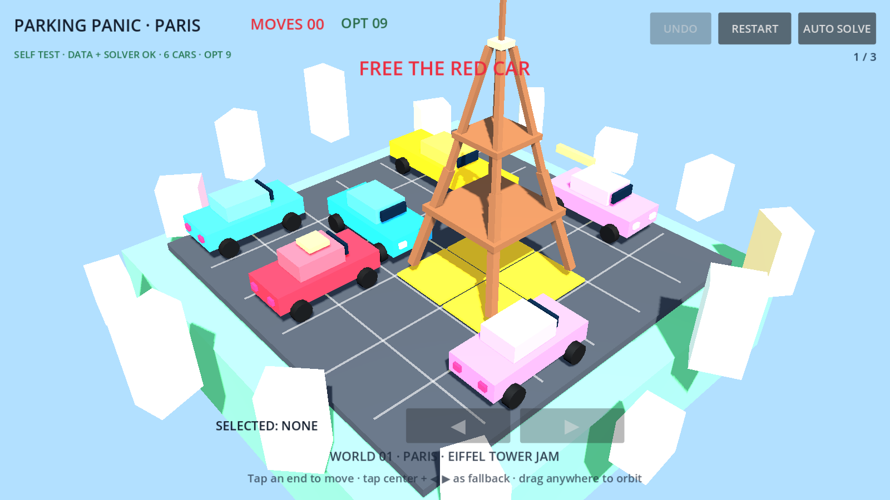

# Parking Panic

## Current visual



Automated CI capture of the configured main scene. Commit and workflow provenance: [`docs/status/current.json`](docs/status/current.json).


Tiny 3D traffic puzzle in Godot 4.3: one-cell sliding-car logic, rotatable landmark diorama worlds, deterministic puzzle data and a path toward cube-face driving.

## Current playable slice — 0.5.1-alpha

- Paris / Eiffel Tower Jam — optimal 9 cell moves
- Cairo / Pyramid Gridlock — optimal 12 cell moves
- Tokyo / Neon Crossing — optimal 12 cell moves
- tap an endcap to move one cell, or tap the body and use large ◀/▶ fallback controls
- drag anywhere to orbit after a movement threshold; tap actions fire on release, reducing accidental moves
- pinch/mouse-wheel zoom
- undo, restart, auto-solve, haptics, synthetic placeholder audio and particles
- next-world progression
- runtime level schema validation plus BFS solvability/optimality validation

## Architecture

Puzzle truth lives in `data/levels/*.json`. The core board and solver do not depend on Node3D presentation. Input, view, world dressing, audio and FX are separate services/components.

Key modules:

- `scripts/model/parking_car_state.gd` — pure car state
- `scripts/model/parking_board.gd` — legal movement, occupancy and exits
- `scripts/data/level_validator.gd` — runtime structural validation
- `scripts/solver/bfs_solver.gd` — optimal one-cell BFS with parent-map path reconstruction
- `scripts/controllers/input_controller.gd` — tap/drag/pinch arbitration and ray picking
- `scripts/view/car_view.gd` — tiny-car visuals, picker volumes and movement animation
- `scripts/world/world_builder.gd` — theme/landmark diorama generation
- `scripts/main.gd` — orchestration only

## Fast local verification

```bash
python tools/run_checks.py
```

That runs:

1. JSON schema/structure checks
2. BFS optimality checks for every level
3. replay of every declared `optimal_path`
4. `res://` reference audit
5. scene/script node-path contract audit

With Godot 4.3 installed:

```bash
godot --headless --path . --script res://tests/test_solver.gd
godot --headless --path . --script res://tests/test_all_levels.gd
godot --headless --path . --script res://tests/test_level_validator.gd
godot --headless --path . --script res://tests/test_board_rules.gd
```

GitHub Actions now verifies the project with the official Godot 4.3 editor on every push/PR: parser/compiler import gate, solver tests, level/board tests and a real GL Compatibility main-scene smoke test under Xvfb.

## Verified CI baseline

The audited 0.5.1 alpha passes:

- dependency-free Python preflight
- Godot 4.3 import with no script parser/compiler errors
- Paris solver: 9 optimal moves / 683 visited states
- Cairo solver: 12 optimal moves / 270 visited states
- Tokyo solver: 12 optimal moves / 1171 visited states
- level-validator and board-rule tests
- graphical main-scene boot using the GL Compatibility renderer

## Status

This is a testable alpha vertical slice, not a production build. Native Godot parsing, puzzle execution and graphical boot are now CI-verified. The largest remaining release gate is a physical Android export/touch smoke test. Procedural visuals/audio are still prototype assets, and the signature multi-face/cube topology remains the next major gameplay milestone after mobile readiness.
